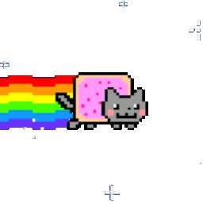

# Game Engine Architecture

## Introduction to UE

---------------------
[Course Index](http://nikoladimitroff.github.io/Game-Engine-Architecture)

<table>
<tbody>
    <tr>
        <td>
            Nikola Dimitroff
        </td>
        <td>
            <a target="_blank" href="https://dimitroff.bg"><i class="fa fa-rss"></i></a>
            <a target="_blank" href="mailto:nikola@dimitroff.bg"><i class="fa fa-envelope-o"></i></a>
            <a target="_blank" href="https://github.com/nikoladimitroff"><i class="fa fa-github"></i></a>
            <a target="_blank" href="https://twitter.com/nikoladimitroff"><i class="fa fa-twitter"></i></a>
        </td>
    </tr>
    <tr>
        <td>
            Alexander Angelov
        </td>
        <td>
            <a target="_blank" href="mailto:aleksandar.angelovv@gmail.com"><i class="fa fa-envelope-o"></i></a>
            <a target="_blank" href="https://github.com/Alekssasho"><i class="fa fa-github"></i></a>
            <a target="_blank" href="https://twitter.com/Alekssasho"><i class="fa fa-twitter"></i></a>
        </td>
    </tr>
    <tr>
        <td>
            Viktor Ketipov
        </td>
        <td>
            <a target="_blank" href="mailto:viktor@kipiinteractive.com"><i class="fa fa-envelope-o"></i></a>
            <a target="_blank" href="https://github.com/k1p1"><i class="fa fa-github"></i></a>
            <a target="_blank" href="https://twitter.com/xk1p1x"><i class="fa fa-twitter"></i></a>

        </td>
    </tr>
</tbody>
</table>

 

 

--- NEXT SLIDE ---

# Sanity check

We are recording, aren't we?

--- NEXT SLIDE ---

## Contents

1. [UE requirements](#/requirements)
1. [Setting up the engine](#/setup)
1. [Game structure](#/game-structure)
1. [Module overview](#/modules-overview)
1. [Coding standard](#/coding-standard)

--- NEXT SLIDE ---

Epic Games use cats in their presentations and since today's topic is UE...

--- NEXT SLIDE ---

<!-- .slide: id="requirements" -->

## UE for our purposes

* We'll run UE mainly pre-built.
* We'll also run UE from source.
* We'll start with UE5.1.1 and upgrade through the course.

--- VERTICAL SLIDE ---

### UE for our purposes

UE requires some not-so-modest hardware.

* 8 GB of RAM
* a DX11 compatible video card
* Quad-core x86 CPU.

--- VERTICAL SLIDE ---

### UE for our purposes

As for software:

* We'll use VS2022 and Win11.
* You can also use VS 2019 v16.11.5 or newer and Windows above 10.
* Or Mac with lates Mac OS Ventura and XCode.
* If you want Linux, see [here](https://wiki.unrealengine.com/Building_On_Linux).

--- NEXT SLIDE ---

<!-- .slide: id="setup" -->

## Setting up UE from Epic Launcher

1. Go to [unrealengine.com](http://unrealengine.com)
and sign up.
2. Download and Install [Epic Launcher](https://www.epicgames.com/store/en-US/download)
3. Download and Install the latest version of Unreal Engine through the Epic Launcher

--- NEXT SLIDE ---

## Running the engine for the first time

* Start UE from Epic Launcher or VS (if you are running from source)
* Create a new project from *Top Down* template.

--- VERTICAL SLIDE ---

1. General Editor UI
1. Scene editor
1. Content browser
1. Plugins
1. Settings
1. Tutorials

--- NEXT SLIDE ---

## Unreal is huge!

 <!-- .element class="constrain-image" -->

--- VERTICAL SLIDE ---

### Unreal is huge!

* Hundreds of modules
* 5k directories
* 40k files
* Millions LOC
* Who-knows-how-many tools
* Centuries of man-years

--- VERTICAL SLIDE ---

### Unreal is huge!

* Initially released in 1998
* It currently supports all desktop, console and mobile platforms
* Handcrafted by Master Tim Sweeny

Worship your new master!

--- VERTICAL SLIDE ---

### Know thy tools

<del>UE</del> All code is bad & buggy

* VS Search-in-files (<kbd>Ctrl</kbd> + <kbd>Shift</kbd> + <kbd>F</kbd>)
* VS Navigate-to (<kbd>Ctrl</kbd> + <kbd>,</kbd>)
* [VS Chromium](http://chromium.github.io/vs-chromium/) (<kbd>Ctrl</kbd> + <kbd>Shift</kbd> + <kbd>;</kbd>)
* Use Go-To-Source on your own risk (<kbd>F12</kbd>)
* VS Outlining
* There's also
[UnrealVS](https://docs.unrealengine.com/latest/INT/Programming/Development/VisualStudioSetup/UnrealVS/index.html)

--- VERTICAL SLIDE ---

### Tips for starting

* Don't expect to learn everything! Even master Tim doesn't!
* UE is well-architectured. In time, you'll see that searching
for unknown features is pretty straightforward (unless you
are searching for core Editor features).

--- NEXT SLIDE ---

Congratulations, comrade, you survived!

Here are a few things to do until the next week:

* Meet the community
  - [Forum](https://forums.unrealengine.com/)
  - [Answer hub](https://answers.unrealengine.com/index.html)
  - [Wiki](https://wiki.unrealengine.com/Main_Page)
  - [Video tutorials](https://www.youtube.com/watch?v=QMsFxzYzFJ8&list=PLZlv_N0_O1gaCL2XjKluO7N2Pmmw9pvhE)
  - [Roadmap](https://portal.productboard.com/epicgames/1-unreal-engine-public-roadmap/tabs/94-forward-looking)
  - [Facebook user group](https://www.facebook.com/groups/ue4devs/?fref=ts)

--- VERTICAL SLIDE ---

...
* Download UE5.1.1 ASAP!
* Play with the [provided samples!](https://docs.unrealengine.com/latest/INT/Resources/SampleGames/index.html)
* Think about what project you want to deliver at the end of the course.

--- NEXT SLIDE ---

Any questions?

 <!-- .element class="constrain-image-medium" -->
